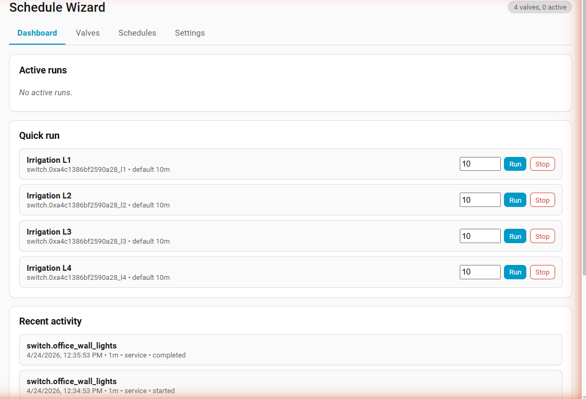
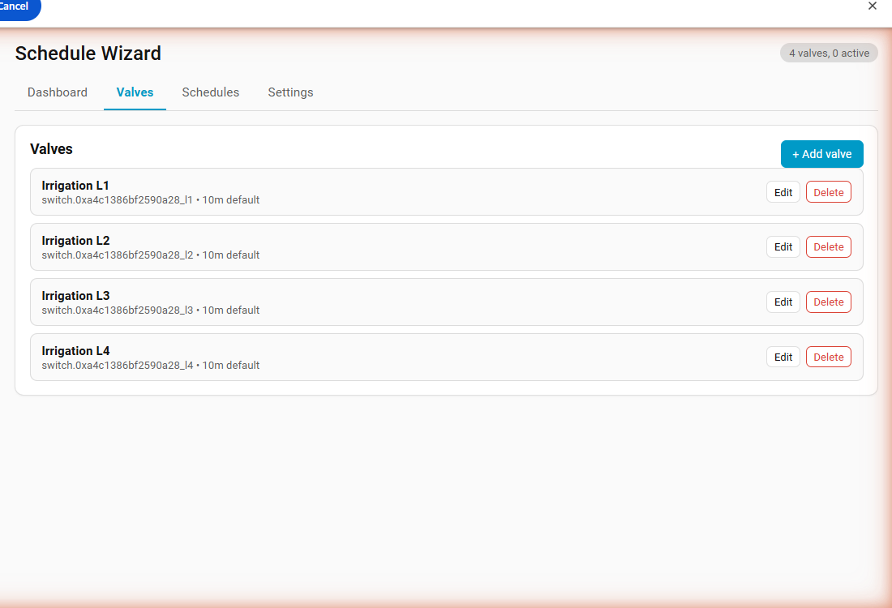
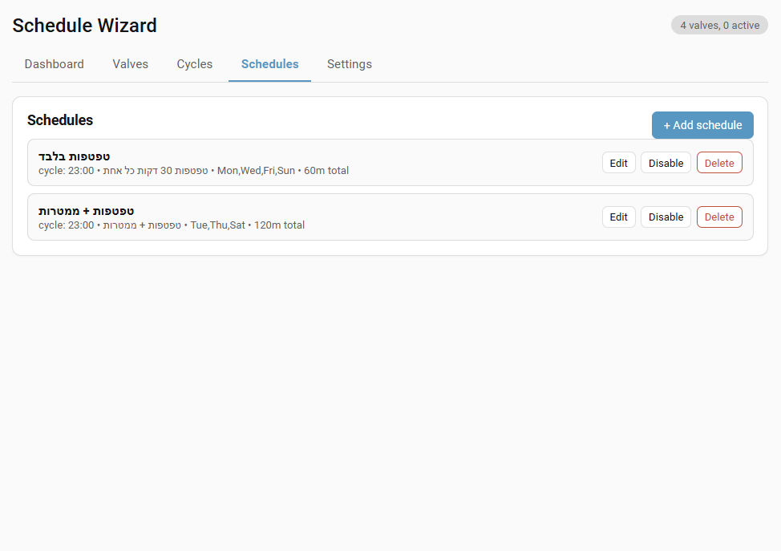
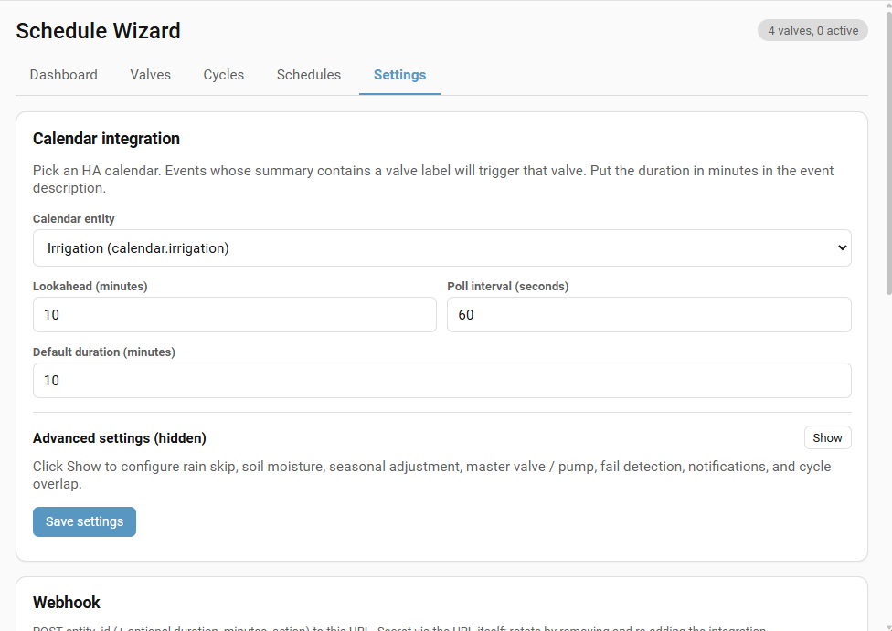

# Schedule Wizard

[](https://hacs.xyz)
[](https://github.com/bareli/schedule_wizard/actions/workflows/validate.yml)
[](LICENSE)

Home Assistant **custom integration** that runs a scheduler for irrigation valves, switches, lights, and covers. Triggers entities on recurring schedules or from calendar events, auto-closes after the configured duration, survives HA restarts. Works on every HA install type (HAOS, Supervised, Container, Core).

## Why

Built-in automations can fire a valve on a schedule, but:

- No built-in duration guard that auto-closes after N minutes.
- No unified view of *"which valve runs next, which is running now."*
- Calendar-driven watering needs per-event minutes; no clean template for that.
- Restarting HA mid-cycle leaves the valve open forever.

Schedule Wizard handles all of the above in one integration with its own sidebar UI.

## Features

- Recurring schedules per valve: HH:MM + any subset of weekdays + duration.
- Calendar-driven runs: event summary matches a valve label, description holds minutes.
- Manual run / stop from the sidebar panel or services.
- Auto-close after configured duration.
- **Active runs persist across HA restarts** — re-arms remaining timers based on entity state.
- Two sensors: `active_runs` (with per-run details) and `next_schedule`.
- Sidebar panel with editable tabs: Dashboard, Valves, Schedules, Settings.
- Single-instance config flow + options flow for HA-native configuration.
- Domain-aware: `switch`, `valve`, `cover`, `input_boolean`, `light` (cover/valve use `open_*` / `close_*`, others use `turn_on` / `turn_off`).
- Persistent storage via HA's `Store` helper (no SQLite, no external DB).

## Install

### Via HACS (recommended)

1. HACS → ⋮ → **Custom repositories** → add `https://github.com/bareli/schedule_wizard` as **Integration**.
2. Search **Schedule Wizard** in HACS → Download.
3. Restart Home Assistant.
4. **Settings → Devices & Services → + Add Integration → Schedule Wizard**.

### Manual

1. Copy `custom_components/schedule_wizard/` into `<config>/custom_components/`.
2. Restart HA.
3. Add the integration from the UI (step 4 above).

Minimum HA version: **2024.7.0**.

## Using the panel

After install, a **Schedule Wizard** entry appears in the sidebar (sprinkler icon). Four tabs:

### Dashboard

Active runs with live progress bars, quick run/stop per valve, recent history.



### Valves

Add / edit / delete valves. Pick any supported HA entity, set its label (used for calendar matching) and default duration.



### Schedules

Recurring rules: pick a valve, time, days, duration.



### Settings

Calendar entity, lookahead window, poll interval, default duration. All editable here; no need to visit the Configure dialog.



Options flow (Settings → Devices & Services → Schedule Wizard → Configure) writes the same values — use whichever you prefer.

## Options

| Key                       | Default                                    | Description                                          |
| ------------------------- | ------------------------------------------ | ---------------------------------------------------- |
| `calendar_entity`         | (none)                                     | HA calendar entity to poll. Optional.                |
| `calendar_lookahead_min`  | 10                                         | Minutes ahead to scan for matching events.           |
| `poll_interval`           | 60                                         | Calendar poll interval in seconds (10–3600).         |
| `default_duration`        | 10                                         | Default run duration when a valve has none set.      |
| `rain_entity`             | (none)                                     | Weather / sensor / binary_sensor entity for rain.    |
| `rain_skip_states`        | `rainy,pouring,snowy,lightning-rainy`      | Skip when entity state matches any of these.         |
| `rain_attribute`          | (none)                                     | Optional attribute to read instead of state.         |
| `rain_threshold`          | (none)                                     | Numeric threshold (mm, %, etc). Skip when ≥ this.    |

## Calendar event format

- **Summary** must contain the valve label (case-insensitive substring match). Example for label `Front lawn`:
  - `Front lawn` ✓
  - `Front Lawn morning cycle` ✓
  - `Garden zone 1` ✗
- **Description**: minutes to run. First integer wins. Falls back to event duration (end − start), then to the valve's default duration.
- **Start time** triggers the run. Events within the lookahead window are caught on the next poll.

## Services

| Service                           | Purpose                                                                   |
| --------------------------------- | ------------------------------------------------------------------------- |
| `schedule_wizard.run_valve`       | Open an entity for `duration_minutes`. Auto-closes when done.             |
| `schedule_wizard.stop_valve`      | Close an entity now. Cancels any active timer.                            |
| `schedule_wizard.add_valve`       | Register a valve (entity_id + label + default duration).                  |
| `schedule_wizard.remove_valve`    | Unregister a valve and delete its schedules.                              |
| `schedule_wizard.add_schedule`    | Add a recurring schedule (time + days + duration). Returns new schedule.  |
| `schedule_wizard.remove_schedule` | Delete a schedule by id.                                                  |
| `schedule_wizard.list_config`     | Return valves, schedules, active runs, recent history (response service). |

All services are visible under **Developer Tools → Actions** with full selectors.

### Examples

Run a valve from a script:

```yaml
service: schedule_wizard.run_valve
data:
  entity_id: switch.front_lawn_valve
  duration_minutes: 15
```

Stop:

```yaml
service: schedule_wizard.stop_valve
data:
  entity_id: switch.front_lawn_valve
```

Add a valve and a schedule:

```yaml
- service: schedule_wizard.add_valve
  data:
    entity_id: switch.front_lawn_valve
    label: Front lawn
    default_duration_minutes: 12

- service: schedule_wizard.add_schedule
  data:
    valve_entity_id: switch.front_lawn_valve
    time: "06:30"
    duration_minutes: 12
    days: [mon, wed, fri]
```

Capture the new schedule id with a response variable:

```yaml
- service: schedule_wizard.add_schedule
  data:
    valve_entity_id: switch.front_lawn_valve
    time: "19:00"
    duration_minutes: 8
    days: [tue, thu]
  response_variable: created
- service: system_log.write
  data:
    message: "New schedule id: {{ created.schedule.id }}"
```

## Cycles (zone sequencing)

A **cycle** is an ordered list of (valve, duration) steps. Start a cycle and the integration runs valve A for its minutes, then valve B, then C, without overlap. Perfect for irrigation programs with multiple zones.

Create from the **Cycles** tab in the sidebar panel: name it, add steps (pick valve + duration), save.

Trigger a cycle from:

- **Panel** — Cycles tab → Run on a cycle row.
- **Schedule** — add a schedule whose target is a cycle instead of a single valve.
- **Calendar event** — event summary contains the cycle name (case-insensitive substring).
- **Service call**:
  ```yaml
  service: schedule_wizard.run_cycle
  data:
    cycle_id: abc123def456
  ```
- **Stop a running cycle**:
  ```yaml
  service: schedule_wizard.stop_cycle
  data:
    cycle_id: abc123def456
  ```

**Notes:**
- Only one run of a cycle at a time; starting it again while already running restarts from step 1.
- Stopping a cycle closes the currently open valve and cancels remaining steps.
- Cycle schedules respect rain-skip (whole cycle is skipped if rain condition active).
- Cycles persist in storage but in-progress cycle state does not survive HA restart (the currently open valve auto-closes per its own timer, but remaining steps won't fire).

## Seasonal adjustment

Scale schedule and calendar run durations based on a temperature sensor. Manual runs are **not** scaled.

Settings → **Seasonal adjustment (temperature-based)**:
- **Temperature entity** — sensor with numeric °C/°F state, or a weather entity (use attribute).
- **Attribute** — optional. For a weather entity, set `temperature`.
- **Low / High temp** — thresholds. Typical: low 10, high 30.
- **Min / Max %** — clamp factor at the edges. Typical: min 50%, max 120%.

Linear interpolation between low↔high. Below low = min %. Above high = max %. 1.0 ( = 100%) means no change.

Example: sensor = 18 °C, low=10, high=30, min=50, max=120. Factor = 50 + (18−10)/(30−10) × (120−50) = 78%. A 10-minute schedule runs for 8 minutes.

## Soil moisture skip

One level above rain skip. Skip cron and calendar triggers when a moisture sensor shows the soil is already wet.

Settings → **Soil moisture skip**:
- **Moisture sensor entity** — e.g. `sensor.garden_moisture`.
- **Attribute** — optional (if value sits on an attribute).
- **Skip when ≥** — numeric threshold. Blank disables. Value scale depends on the sensor (e.g. 60 = 60% wetness).

Fires event `schedule_wizard_moisture_skipped` with `target`, `kind`, `schedule_id`, `source`.

Manual runs and cycles are not affected.

## Cycle overlap protection

By default, a new cycle (from schedule or calendar) is **skipped** if any cycle is already running, to avoid opening the same valve twice or overlapping irrigation zones.

Settings → **Cycle overlap → Allow concurrent cycles**:
- Off (default) — schedule/calendar triggers skip while another cycle is active.
- On — multiple cycles run in parallel (use only if your cycles target disjoint valves).

Skipped runs fire `schedule_wizard_cycle_skipped_overlap` event.

Manual runs always proceed (existing cycle of the same id is replaced).

## Events

The integration fires events on the HA event bus. Use them as triggers for any automation.

| Event                                    | When                                                 | Data                                                             |
| ---------------------------------------- | ---------------------------------------------------- | ---------------------------------------------------------------- |
| `schedule_wizard_valve_started`          | A valve opens (manual, schedule, cycle)              | `entity_id`, `label`, `source`, `duration_min`, `started_at`, `ends_at`, `note` |
| `schedule_wizard_valve_ended`            | A valve closes                                       | `entity_id`, `label`, `status` (`completed`/`cancelled`), `source`, `duration_min`, `note` |
| `schedule_wizard_cycle_started`          | A cycle begins                                       | `cycle_id`, `name`, `source`, `total_steps`, `started_at`, `note` |
| `schedule_wizard_cycle_ended`            | A cycle finishes or is cancelled                     | `cycle_id`, `name`, `status` (`completed`/`cancelled`), `source` |
| `schedule_wizard_rain_skipped`           | A cron schedule was skipped due to rain              | `target`, `kind` (`valve`/`cycle`), `label`/`name`, `source`, `schedule_id` |
| `schedule_wizard_moisture_skipped`       | A cron schedule was skipped due to wet soil          | `target`, `kind`, `label`/`name`, `source`, `schedule_id`        |
| `schedule_wizard_cycle_skipped_overlap`  | A schedule/calendar cycle skipped while another ran  | `cycle_id`, `name`, `source`, `schedule_id`, `busy_with`         |

**Schedule vs. calendar vs. manual:** the `source` field tells you how the run was triggered (`schedule`, `calendar`, `manual`, `service`, `webhook`, `cycle:<id>`). Filter on it in automation conditions.

### Example automation

```yaml
alias: "Irrigation: log cycle completion"
trigger:
  - platform: event
    event_type: schedule_wizard_cycle_ended
action:
  - service: system_log.write
    data:
      message: >
        Cycle {{ trigger.event.data.name }} ended with status
        {{ trigger.event.data.status }} (source: {{ trigger.event.data.source }})
```

```yaml
alias: "Alert on cancelled valve"
trigger:
  - platform: event
    event_type: schedule_wizard_valve_ended
    event_data:
      status: cancelled
action:
  - service: notify.mobile_app_my_phone
    data:
      title: "Irrigation"
      message: "{{ trigger.event.data.label }} was cancelled mid-run"
```

## Notifications

Push events to any `notify.*` service (HA Companion app, Telegram, Pushover, email, Slack, etc).

**Panel → Settings → Notifications:**
1. Tick one or more notify services (each one detected in your HA install shows as a checkbox).
2. Tick which events should fire notifications:
   - `valve_start` — a valve opens
   - `valve_end` — a valve closes (completed, cancelled, error)
   - `cycle_start` — a cycle starts
   - `cycle_end` — a cycle finishes or is cancelled
   - `skipped_rain` — a scheduled run or cycle was skipped due to rain
3. Save.

**On phone:** install the Home Assistant Companion app, it auto-creates `notify.mobile_app_<device>` services. Those appear in the target list automatically.

**Multi-device:** pick multiple targets — notifications fan out to all picked services in parallel.

**Failure behavior:** notify errors log a warning; they never block the valve or cycle itself.

## Rain skip

When a rain entity is configured, cron schedules consult it before firing.

Three modes, checked in this order:

1. **Attribute + threshold** — reads `attribute` off the entity, compares numerically to `threshold`. Skip if ≥.
2. **Threshold only** — parses the entity's state as a number, compares to `threshold`. Skip if ≥.
3. **Skip states** — compares entity state to comma-separated list in `rain_skip_states`. Skip if match.

Skipped schedules log `skipped_rain` in history. Manual runs and calendar-triggered runs are **not** affected by rain skip.

Example configs:

```text
# HA weather entity:
rain_entity: weather.home
rain_skip_states: rainy,pouring,snowy,lightning-rainy

# Numeric rain sensor (mm forecast next N hours):
rain_entity: sensor.rain_forecast_12h_mm
rain_threshold: 2

# Weather entity attribute:
rain_entity: weather.home
rain_attribute: precipitation
rain_threshold: 1
```

## Webhook trigger

Each integration install gets a unique webhook ID. Fire runs from anything that can POST:

```bash
curl -X POST https://<your-ha-url>/api/webhook/<WEBHOOK_ID> \
  -H 'Content-Type: application/json' \
  -d '{"entity_id": "switch.front_lawn_valve", "duration_minutes": 15}'
```

Stop action:

```bash
curl -X POST https://<your-ha-url>/api/webhook/<WEBHOOK_ID> \
  -H 'Content-Type: application/json' \
  -d '{"entity_id": "switch.front_lawn_valve", "action": "stop"}'
```

Find your webhook ID: Developer Tools → Services → `schedule_wizard.list_config` → the panel Settings tab also surfaces it.

No HA auth token required for webhooks — the webhook ID itself is the secret. Rotate by removing and re-adding the integration if leaked.

## Lovelace card

The integration auto-registers a dashboard card resource. Add to any view:

```yaml
type: custom:schedule-wizard-card
title: Irrigation
show_active: true
show_quick_run: true
valves:
  - switch.front_lawn_valve
  - switch.back_lawn_valve
```

Options:
- `title` — card header. Default `"Schedule Wizard"`.
- `show_active` — show active runs section. Default `true`.
- `show_quick_run` — show quick run/stop rows. Default `true`.
- `valves` — optional list of entity_ids to filter. If omitted, all valves are shown.

## Hebrew

Translations for Hebrew (`he`) are included in `translations/he.json`. HA picks the right one based on your user language preference.

## Sensors

- `sensor.schedule_wizard_active_runs` — integer count of currently running valves; attributes include a `runs` array with `entity_id`, `source`, `started_at`, `ends_at`, `remaining_seconds`, `duration_min`.
- `sensor.schedule_wizard_next_schedule` — friendly label of the next scheduled run (e.g. `"Mon 06:30"`); attributes include `valve_entity_id`, `schedule_id`, `duration_min`, `fires_in_minutes`.

Use them to build custom Lovelace cards or drive automations that react to scheduler state.

## Advanced automations

Schedule Wizard exposes services you can wire into any HA automation. A few recipes:

### Rain skip

Cancel a schedule automatically when rain is forecast.

```yaml
alias: "Irrigation: skip if rain expected"
trigger:
  - platform: state
    entity_id: sensor.schedule_wizard_next_schedule
condition:
  - condition: numeric_state
    entity_id: sensor.rain_forecast_12h_mm
    above: 2
action:
  - service: schedule_wizard.remove_schedule
    data:
      schedule_id: "{{ state_attr('sensor.schedule_wizard_next_schedule', 'schedule_id') }}"
```

### Soil moisture skip

Run the valve only if moisture is below a threshold.

```yaml
alias: "Irrigation: run only if soil dry"
trigger:
  - platform: time
    at: "06:00:00"
condition:
  - condition: numeric_state
    entity_id: sensor.garden_moisture
    below: 40
action:
  - service: schedule_wizard.run_valve
    data:
      entity_id: switch.front_lawn_valve
      duration_minutes: 12
```

### Zone sequencing

Run valve B after valve A finishes. Use the completion as the trigger by watching the entity state going off plus `sensor.schedule_wizard_active_runs` dropping.

```yaml
alias: "Irrigation: zone B after zone A"
trigger:
  - platform: state
    entity_id: switch.zone_a_valve
    to: "off"
    for:
      seconds: 5
condition:
  - condition: template
    value_template: >
      {{ state_attr('sensor.schedule_wizard_active_runs', 'runs')
         | selectattr('entity_id', 'eq', 'switch.zone_a_valve')
         | list | count == 0 }}
action:
  - service: schedule_wizard.run_valve
    data:
      entity_id: switch.zone_b_valve
      duration_minutes: 10
```

### Run-start notification

```yaml
alias: "Irrigation: notify on start"
trigger:
  - platform: state
    entity_id: sensor.schedule_wizard_active_runs
action:
  - service: notify.mobile_app_my_phone
    data:
      message: >
        
        
          Irrigation started: {{ runs|map(attribute='entity_id')|join(', ') }}
        
          All valves closed.
        
```

## FAQ

**Q: Does the integration expose irrigation-specific entities (flow, pressure, season)?**
A: No. It treats every supported entity as a generic "open for N minutes" target. Add external sensors and automations to layer weather, flow, or pressure logic on top.

**Q: Can two schedules run on the same valve at the same time?**
A: No. A second run on an already-active valve cancels the first (older run is logged as `cancelled`, new run starts).

**Q: What happens if the calendar event spans midnight?**
A: The run triggers at the event start time. Duration is taken from the event description (minutes), or from event length. Midnight has no special meaning.

**Q: Can I use this for non-irrigation things (e.g., outdoor lights for N minutes)?**
A: Yes. Any `switch` / `light` / `input_boolean` / `cover` / `valve` works. Irrigation is the original use case, not a restriction.

**Q: Does the panel work on mobile / HA Companion app?**
A: Yes. The UI is responsive; layout collapses to a single column on narrow screens.

**Q: Where is the data stored? Can I back it up?**
A: `<config>/.storage/schedule_wizard.data` — plain JSON. Included in any full HA config backup (Settings → System → Backups).

**Q: How do I reset / start over?**
A: Delete the integration (Settings → Devices & Services → Schedule Wizard → ⋮ → Delete), then reinstall and re-add. Or delete `<config>/.storage/schedule_wizard.data` manually and restart.

## Roadmap

Not committed dates; directional.

- Lovelace card bundled with the integration (embed dashboard widget, not only sidebar panel).
- Weather-aware rules (rain forecast skip, temp threshold) without external automations.
- Soil moisture integration hook (skip when wet).
- Zone sequencing primitive (multi-valve cycle as a first-class object).
- Webhook trigger (external cron/HTTP service can fire runs).
- Translations (strings already extracted; add Hebrew, Spanish, German).
- Per-valve max runs per day / cooldown.

Want one of these soon? Open an issue.

## Restart behavior

On HA restart, the scheduler re-reads active runs from storage and checks each entity:

| Entity state    | Remaining time  | Action                                  |
| --------------- | --------------- | --------------------------------------- |
| ON / open       | > 0 seconds     | Re-arm auto-close for remaining time.   |
| ON / open       | ≤ 0 seconds     | Close immediately, log as expired.      |
| OFF / closed    | any             | Drop run, log as cancelled.             |

## Troubleshooting

- **Integration won't load.** Check `Settings → System → Logs`, filter `schedule_wizard`. Min HA version is 2024.7.
- **Calendar events don't fire.** Verify calendar entity is selected in Settings tab. Check event summary contains the valve label *exactly* (case-insensitive substring). Enable debug logging:
  ```yaml
  logger:
    default: warning
    logs:
      custom_components.schedule_wizard: debug
  ```
- **Valve stays on after restart.** Expected if `active_runs` storage was lost (fresh install) or entity was manually turned off during downtime. Normal runs persist.
- **"Unsupported domain"** from service call. Only `switch`, `valve`, `cover`, `input_boolean`, `light` are allowed.

## Contributing

Issues + PRs welcome at [github.com/bareli/schedule_wizard](https://github.com/bareli/schedule_wizard).

## License

MIT — see [LICENSE](LICENSE).
