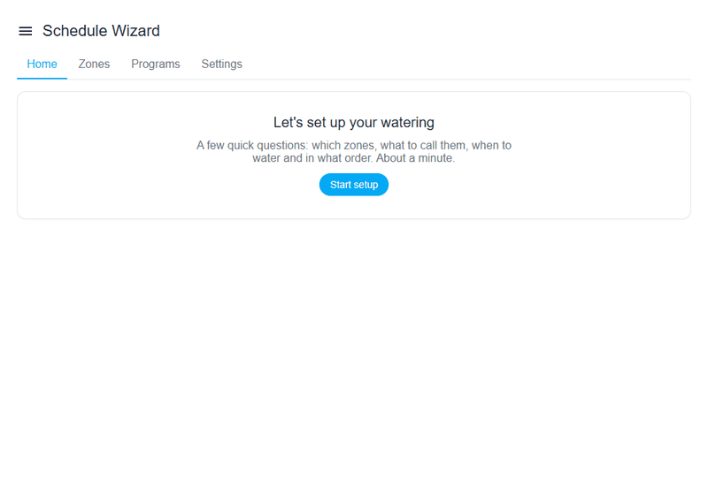
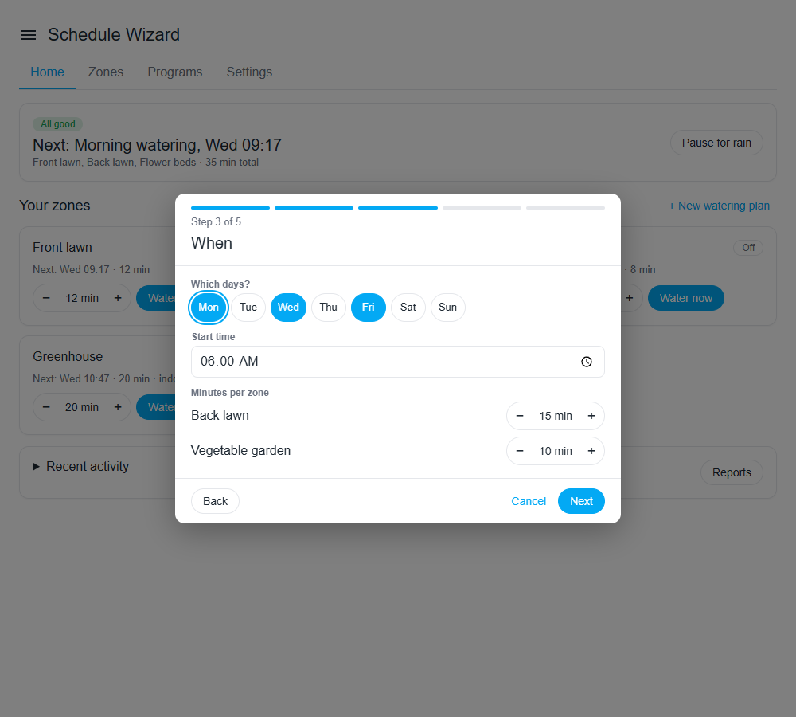
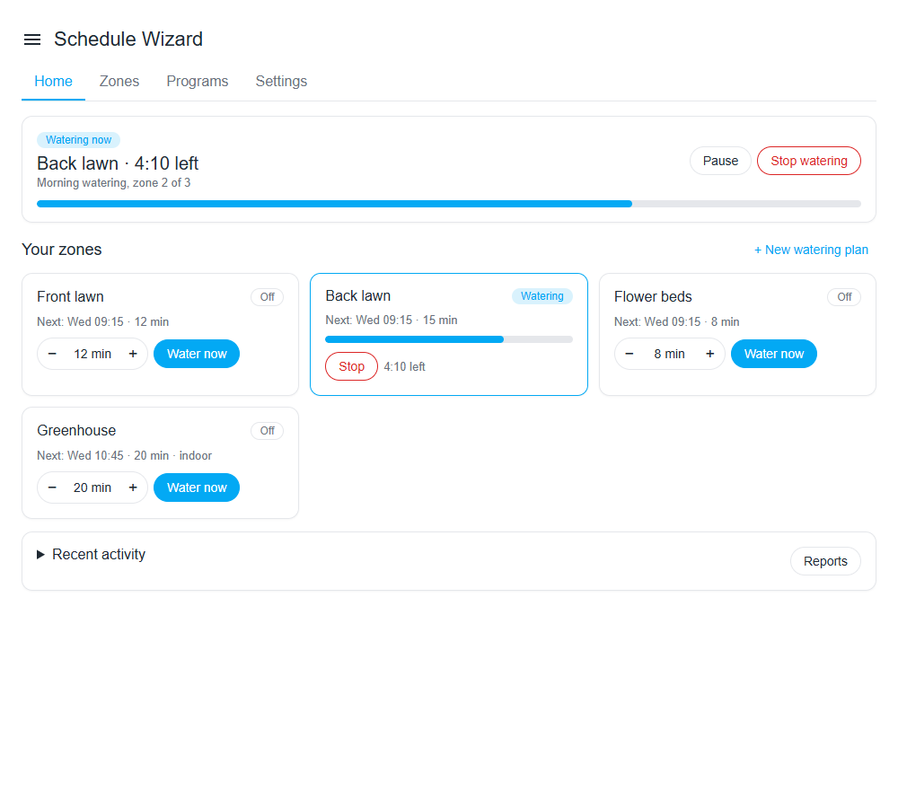
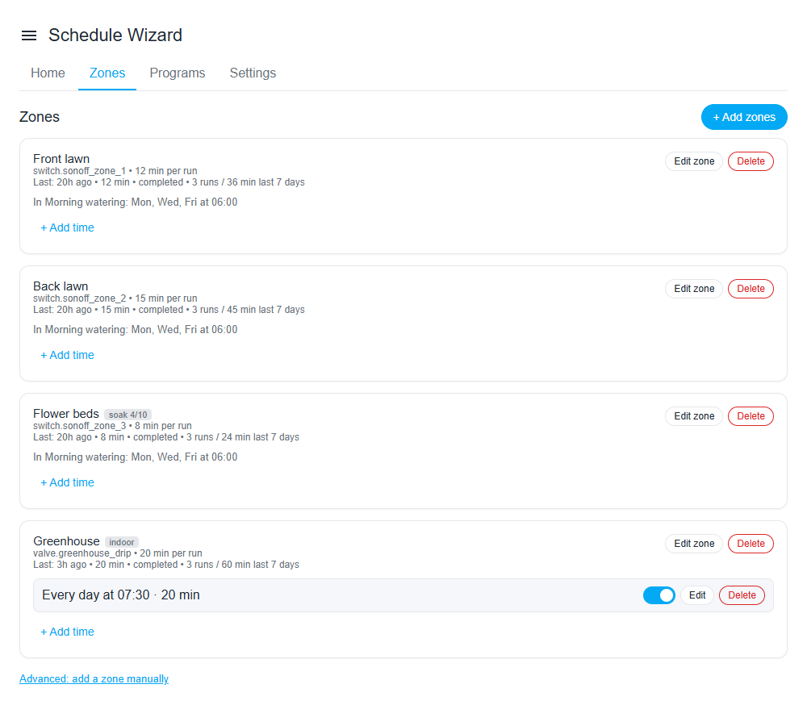
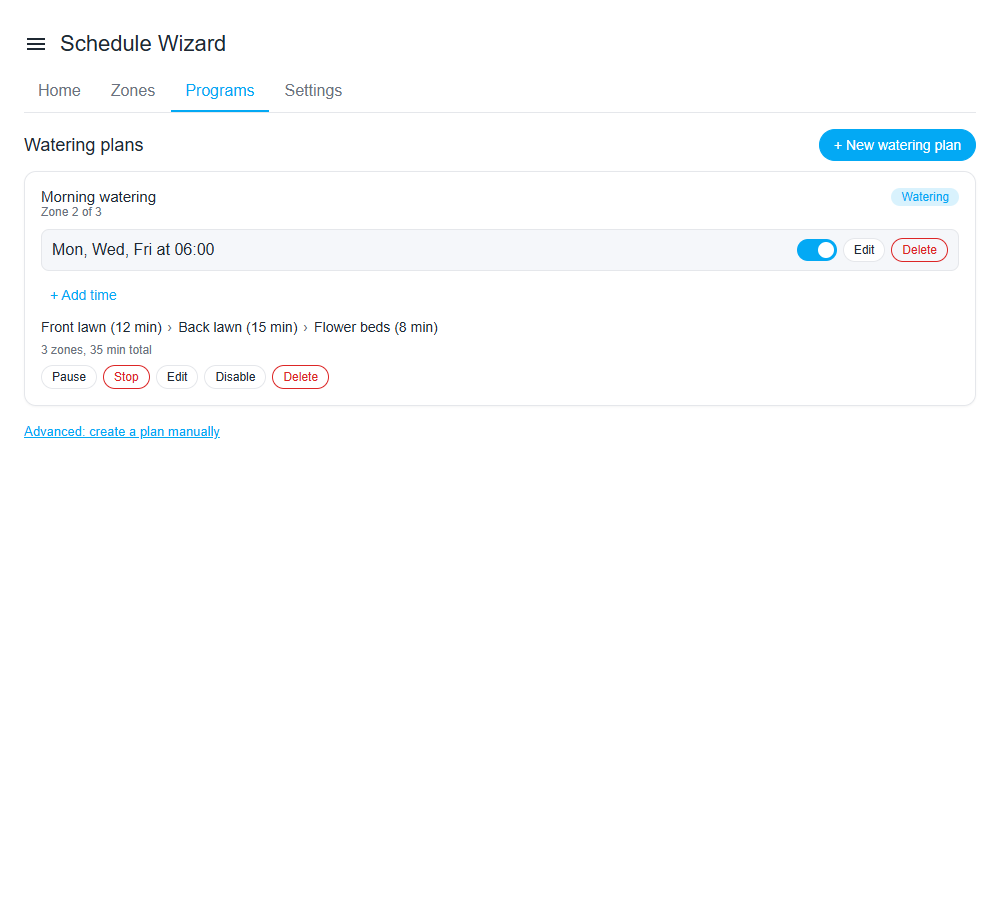
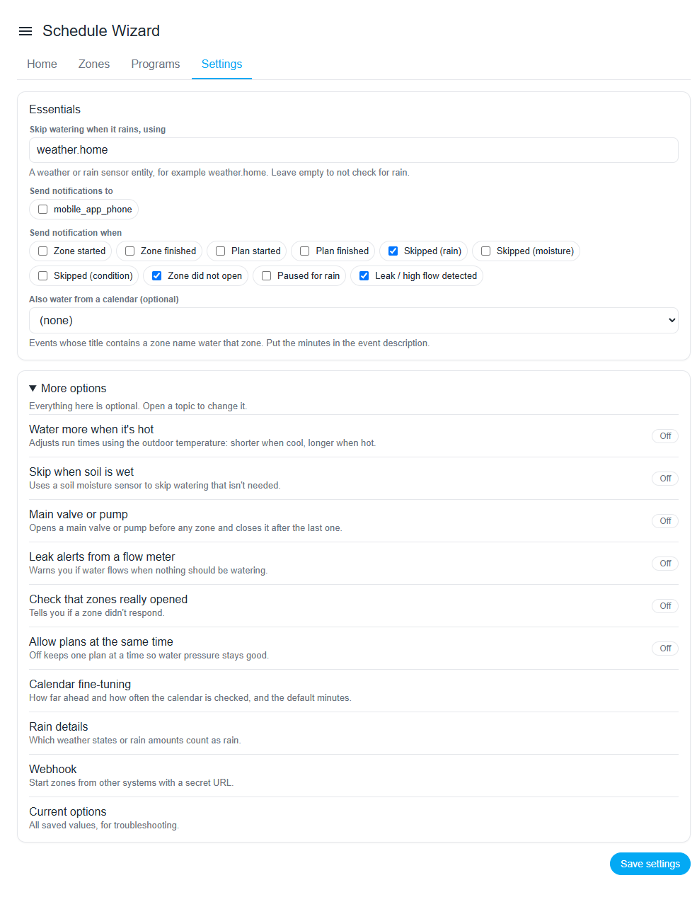

# Schedule Wizard

[](https://hacs.xyz)
[](https://github.com/bareli/schedule_wizard/actions/workflows/validate.yml)
[](LICENSE)

Home Assistant **custom integration** that runs a scheduler for irrigation valves, switches, lights, and covers. Triggers entities on recurring schedules or from calendar events, auto-closes after the configured duration, survives HA restarts. Works on every HA install type (HAOS, Supervised, Container, Core).



## Why

Built-in automations can fire a valve on a schedule, but:

- No built-in duration guard that auto-closes after N minutes.
- No unified view of *"which valve runs next, which is running now."*
- Calendar-driven watering needs per-event minutes; no clean template for that.
- Restarting HA mid-cycle leaves the valve open forever.

Schedule Wizard handles all of the above in one integration with its own sidebar UI.

## Features

**Core scheduling**
- Recurring schedules per valve: HH:MM + any subset of weekdays + duration, or **every N days** (2 to 30) from a start date.
- **Cycles (zone sequencing)**: ordered list of (valve, duration) steps run in series, as a single program. Schedule and calendar can target a cycle just like a single valve.
- Calendar-driven runs: event summary matches a valve **or cycle** label/name, description holds minutes (for valves).
- Manual run / stop / **pause / resume** from the sidebar panel or services.
- Auto-close after configured duration.
- **Active runs persist across HA restarts** — re-arms remaining timers based on entity state.

**Smart skipping & adjustment**
- **Rain delay** button: skip schedule + calendar runs for 24h / 48h / 7d (or custom hours), for all valves or a single valve.
- **Indoor valves**: mark a valve as indoor so the global rain delay and rain skip don't apply to it (greenhouse, balcony, drip under cover).
- **Rain skip**: optional weather/sensor entity; skip when state matches a list or numeric value crosses a threshold.
- **Rain forecast skip**: skip outdoor zones when the weather forecast expects N mm or more in the next 6 to 48 hours.
- **Soil moisture skip**: optional global moisture sensor, plus an optional **per-valve** sensor that overrides it for that zone (also checked per step inside cycles).
- **Schedule conditions**: attach up to 10 entity conditions to a schedule (`above` / `below` / `equals` / `not_equals`, state or attribute). The run is skipped unless all hold.
- **Cycle & soak**: per valve, split long runs into chunks with soak pauses so water sinks in instead of running off (slopes, clay). In a watering plan, the next zone waters while one soaks.
- **Seasonal adjustment** (temperature-scaled): scales schedule and calendar durations between low/high temperature thresholds, clamped to min/max percentages. Manual runs are not scaled.
- **Cycle overlap protection**: schedule/calendar cycles skip while another cycle runs (off by default; opt-in `allow_concurrent_cycles`).

**Reliability**
- **Master valve / pump support**: a central valve auto-opens before any zone, auto-closes after the last zone closes. Optional pre-open delay for pump pressurization.
- **Fail-to-open detection**: verifies the valve actually went on within N seconds; logs error, fires `valve_failed_to_open` event, sends notification if not.
- **Flow sensor leak detection**: alerts on flow while nothing is watering (leak) or above a max while watering (burst pipe); optionally stops everything and closes the master valve.
- **Water used per zone** in litres (measured by the flow meter, or estimated from a zone's flow rate), with sensors for the Energy dashboard and a **low-flow warning** when a zone gets much less water than usual.
- **Stop all** button and service for an instant shutdown of every valve, soak sequence and cycle.

**Visibility**
- Sidebar panel with six tabs: Dashboard, Valves, Cycles, Schedules, Reports, Settings (Basic / Advanced split, so beginners only see what they need).
- Lovelace card (`custom:schedule-wizard-card`) with active-run progress and Quick Run.
- Per-valve **last run / 7-day stats / next opening** on the Dashboard, Valves tab, and Lovelace card.
- **Recent activity** groups cycle runs with each valve opening indented under the parent cycle.
- **Home Assistant entities** for every zone and plan (water / stop switches, time left, plan on/off, run buttons), a "watering now" sensor, a rain delay switch and a **calendar** with upcoming runs.
- **Voice control through Assist** in English, German and Hebrew: "water the front lawn for 10 minutes", "stop watering", "skip watering today".
- **This week** view of upcoming runs, with skip / undo per run or per day.
- **Reminder notifications** with **Skip today** and **Water now** buttons (HA mobile app).
- 14 events fired on the HA event bus, ready as automation triggers.

**Triggers**
- Webhook (per-entry auto-generated URL): fire valve runs from external systems.
- Notifications: pick any `notify.*` service(s); choose which events trigger pushes.

**i18n**
- Sidebar panel and Lovelace card in **17 languages** (right-to-left for Hebrew and Arabic), following your HA profile language. Dates, times and weekdays use your locale and HA time zone.
- 17 languages for the config flow and service descriptions: English, Hebrew, Spanish, German, French, Italian, Dutch, Portuguese, Russian, Arabic, Polish, Simplified Chinese, Ukrainian, Swedish, Danish, Norwegian, Finnish.

**Platform**
- Single-instance config flow + options flow for HA-native configuration.
- Domain-aware: `switch`, `valve`, `cover`, `input_boolean`, `light` (cover/valve use `open_*` / `close_*`, others use `turn_on` / `turn_off`).
- Persistent storage via HA's `Store` helper (no SQLite, no external DB).

## Install

### Via HACS (recommended)

1. HACS → ⋮ → **Custom repositories** → add `https://github.com/bareli/schedule_wizard` as **Integration**.
2. Search **Schedule Wizard** in HACS → Download.
3. Restart Home Assistant.
4. **Settings → Devices & Services → + Add Integration → Schedule Wizard**.

### Manual

1. Copy `custom_components/schedule_wizard/` into `<config>/custom_components/`.
2. Restart HA.
3. Add the integration from the UI (step 4 above).

Minimum HA version: **2024.7.0**.

## Using the panel

After install, a **Schedule Wizard** entry appears in the sidebar (sprinkler icon). Four tabs, written in plain words: a **zone** is one valve or switch, a **watering plan** is a set of zones that water on the same days and time.

### Setup wizard

First time you open the panel, **Start setup** walks you through five short steps: tick your switches, name the zones, pick days, start time and minutes, choose "one zone at a time" or "all together", then save. It creates the zones, the plan and its schedule for you. Run it again any time with **+ New watering plan**.



### Home

One status card at the top: watering now (with time left and Stop), paused for rain, or the next run. Below it, a card per zone with minutes and **Water now**. Pause for rain (all zones or one zone), stop everything, recent activity and **Reports** are all here.



### Zones

Every zone with its schedule written out ("Mon, Thu at 06:00 · 10 min" or "Every 2 days from Oct 5, 2026 at 05:30 · 15 min"). Edit a zone (name, minutes, indoor, split long runs, its own moisture sensor), add or change its times.



### Programs

Your watering plans: zones in order, the days and times they run, Run now / Pause / Stop, and Edit for the full step editor.

### Every N days

In a watering time's editor, set **Repeat** to **Every 2 to 30 days** instead of **Days of the week**, then pick the **days between waterings** (2 to 30) and **First watering on** (today by default). A line under the fields shows the first run (for example "First run: Sat, Oct 3 06:00, then every 2 days") and says so when today's time has already passed. The schedule runs on that date and every N days after it, at the same time, with the same zone or plan, skips and conditions as a weekday schedule. Days are counted on the calendar in your Home Assistant time zone, so runs stay at the same clock time when daylight saving time starts or ends. The next-run times, the week view, `calendar.schedule_wizard_watering_schedule` and `sensor.schedule_wizard_next_schedule` all follow it, including a first watering date months ahead. Schedules created before 0.14.0 keep their days of the week.

### Sunrise and sunset

In a watering time's editor, set **Start at** to **Sunrise** or **Sunset** instead of **A set time**, then enter the **Minutes** (0 to 180) and pick **before** or **after**: for example 30 minutes before sunrise. The start time is worked out for each day from your Home Assistant location (Settings → System → General) and time zone, so it moves with the seasons and stays right when daylight saving time starts or ends. A line under the fields shows the next three start times. It works with days of the week and with every N days, for zones and plans; next-run times, the week view, the calendar entity, reminders and `sensor.schedule_wizard_next_schedule` follow it.

- A start that the offset would push past midnight runs on its own day at 00:00 or 23:59.
- On a day without a sunrise or sunset (polar day or night) the schedule does not run.
- Services: `time_mode: sunrise` (or `sunset`, default `clock`) and `sun_offset_minutes` (-180 to 180, negative = before). A clock `time` is then optional; it is kept, so switching back to `clock` restores it.



### Reports

Opened from Home. 30-day daily-minutes chart, per-zone and per-plan totals, skip reasons, CSV export of the full history.

### Settings

Three essentials: rain sensor, notifications, calendar. Everything else sits under **More options**, one group per feature with a one-line explanation: hot-weather adjustment, wet-soil skip, main valve or pump, leak alerts, open-check, plans at the same time, calendar fine-tuning, rain details, webhook.



Options flow (Settings → Devices & Services → Schedule Wizard → Configure) edits the basic options too.

## Options

| Key                       | Default                                    | Description                                          |
| ------------------------- | ------------------------------------------ | ---------------------------------------------------- |
| `calendar_entity`         | (none)                                     | HA calendar entity to poll. Optional.                |
| `calendar_lookahead_min`  | 10                                         | Minutes ahead to scan for matching events.           |
| `poll_interval`           | 60                                         | Calendar poll interval in seconds (10–3600).         |
| `calendar_keyword`        | (none)                                     | Only calendar events whose title starts with this word water (for example `water:`). Up to 40 characters. |
| `max_external_minutes`    | 120                                        | Longest run a calendar event or webhook call may start (1 to 1440 minutes); longer ones are shortened. |
| `default_duration`        | 10                                         | Default run duration when a valve has none set.      |
| `rain_entity`             | (none)                                     | Weather / sensor / binary_sensor entity for rain.    |
| `rain_skip_states`        | `rainy,pouring,snowy,lightning-rainy`      | Skip when entity state matches any of these.         |
| `rain_attribute`          | (none)                                     | Optional attribute to read instead of state.         |
| `rain_threshold`          | (none)                                     | Numeric threshold (mm, %, etc). Skip when ≥ this. Blank or 0 = off. |
| `flow_entity`             | (none)                                     | Flow sensor (e.g. L/min) for leak detection.         |
| `flow_leak_threshold`     | 0                                          | Leak alert when flow is above this with no valve on. 0 = off. |
| `flow_max_running`        | 0                                          | High-flow alert above this while watering. 0 = off.  |
| `flow_delay_sec`          | 60                                         | Condition must persist this long before alerting.   |
| `flow_stop_all`           | false                                      | On alert, stop all watering and close master valve.  |

The HA **Configure** dialog only edits the basic options; it no longer wipes the advanced settings made in the panel. Saving settings is applied live: running cycles are not interrupted.

## Calendar event format

- **Summary** must contain the zone label or plan name as **whole words** (case-insensitive). Only the summary is read, never the description, location or attendees. Example for label `Front lawn`:
  - `Front lawn` ✓
  - `Front Lawn morning cycle` ✓
  - `Front lawns` ✗ (since 0.14.1: part of a longer word no longer counts)
  - `Garden zone 1` ✗
- A label or name of 1 or 2 characters (for example `A` or `B2`) only matches an event whose whole summary is exactly that label, so ordinary events such as "Lunch with a friend" never start zone `A`.
- Anyone who can put an event on the selected calendar can start watering. If your calendar accepts invitations automatically (Google, Outlook, CalDAV), pick a dedicated calendar for watering. Home Assistant does not tell integrations who organised an event, so it cannot be filtered by sender.
- **Calendar keyword** (Settings → More options → Calendar fine-tuning, optional): when set, for example `water:`, only events whose title starts with it count (any case), and the zone or plan name is matched in the rest of the title: `water: Front lawn` ✓, `Front lawn` ✗. An invitation from someone else then only waters if its title starts with your keyword.
- **Longest calendar or webhook run** (same group, default 120 minutes): a longer event, or one whose description asks for more, is shortened to it. History keeps the requested minutes in the note (`capped:300`) and Recent activity shows "shortened from 300 min". Plans keep their own step times.
- **Description**: minutes to run, written as `15 min` / `15 minutes` / `15 דקות`, or the description is just the number (`15`). Other numbers (like "Zone 2") are ignored. Falls back to event duration (end − start), then to the valve's default duration.
- **Start time** triggers the run. Events within the lookahead window are caught on the next poll. Rain delay, rain skip, moisture skip and seasonal adjustment are evaluated when the event fires.
- **All-day events are ignored** (they would otherwise run a valve for 24 hours).
- Deleting or moving an event in the calendar cancels its pending run.

## Services

Limits (since 0.14.1): zone labels and plan / watering time names up to 80 characters, moisture attributes and condition values up to 255; at most 200 zones, 200 watering times and 200 plans. Existing longer labels keep working; only new or changed ones are checked.

| Service                           | Purpose                                                                                       |
| --------------------------------- | --------------------------------------------------------------------------------------------- |
| `schedule_wizard.run_valve`       | Open an entity for `duration_minutes`. Auto-closes when done.                                 |
| `schedule_wizard.stop_valve`      | Close an entity now. Cancels any active timer.                                                |
| `schedule_wizard.add_valve`       | Register or update a valve (entity_id + label + default duration; optional soak and per-valve moisture fields). |
| `schedule_wizard.remove_valve`    | Unregister a valve and delete its schedules.                                                  |
| `schedule_wizard.add_schedule`    | Add a recurring schedule (time, or `time_mode` sunrise / sunset + `sun_offset_minutes` + `days` **or** `every_n_days` (2 to 30) with optional `start_date` (default today) + duration; targets a registered valve or a cycle; optional `conditions`). Returns new id. |
| `schedule_wizard.update_schedule` | Patch an existing schedule by id. `days` switches it to weekdays, `every_n_days` / `start_date` to every N days, `time` alone to a clock time, `time_mode` / `sun_offset_minutes` to sunrise or sunset. |
| `schedule_wizard.remove_schedule` | Delete a schedule by id.                                                                      |
| `schedule_wizard.add_cycle`       | Create a cycle: ordered list of `{entity_id, duration_minutes}` steps.                        |
| `schedule_wizard.update_cycle`    | Patch an existing cycle.                                                                      |
| `schedule_wizard.remove_cycle`    | Delete a cycle. Also removes schedules pointing to it.                                        |
| `schedule_wizard.run_cycle`       | Start a cycle now; valves run sequentially.                                                   |
| `schedule_wizard.stop_cycle`      | Cancel a running cycle.                                                                       |
| `schedule_wizard.pause_cycle`     | Pause an in-progress cycle. Current valve closes; remaining steps wait for resume.            |
| `schedule_wizard.resume_cycle`    | Resume a paused cycle from where it left off.                                                 |
| `schedule_wizard.set_rain_delay`  | Skip schedule and calendar runs for the next N hours; all valves, or only `entity_id` valves. |
| `schedule_wizard.clear_rain_delay`| Clear the global delay, or only the delay of `entity_id` valves.                              |
| `schedule_wizard.stop_all`        | Stop every running valve, soak sequence and cycle, then close the master valve.               |
| `schedule_wizard.skip_next`       | Skip the next run of one schedule (`schedule_id`).                                            |
| `schedule_wizard.skip_day`        | Skip every run on a `date` (default: the rest of today).                                      |
| `schedule_wizard.unskip`          | Undo a skip (`schedule_id`, `date`).                                                          |
| `schedule_wizard.run_schedule`    | Start a schedule's zone or plan now and drop today's scheduled run of it.                     |
| `schedule_wizard.list_config`     | Return valves, schedules, cycles, active runs, active cycles, recent history (response).     |

All services are visible under **Developer Tools → Actions** with full selectors.

### Examples

Run a valve from a script:

```yaml
service: schedule_wizard.run_valve
data:
  entity_id: switch.front_lawn_valve
  duration_minutes: 15
```

Stop:

```yaml
service: schedule_wizard.stop_valve
data:
  entity_id: switch.front_lawn_valve
```

Add a valve and a schedule:

```yaml
- service: schedule_wizard.add_valve
  data:
    entity_id: switch.front_lawn_valve
    label: Front lawn
    default_duration_minutes: 12

- service: schedule_wizard.add_schedule
  data:
    valve_entity_id: switch.front_lawn_valve
    time: "06:30"
    duration_minutes: 12
    days: [mon, wed, fri]
```

Water every other day, starting on a given date:

```yaml
- service: schedule_wizard.add_schedule
  data:
    valve_entity_id: switch.front_lawn_valve
    time: "06:00"
    duration_minutes: 10
    every_n_days: 2
    start_date: "2026-10-05"
```

Capture the new schedule id with a response variable:

```yaml
- service: schedule_wizard.add_schedule
  data:
    valve_entity_id: switch.front_lawn_valve
    time: "19:00"
    duration_minutes: 8
    days: [tue, thu]
  response_variable: created
- service: system_log.write
  data:
    message: "New schedule id: {{ created.schedule.id }}"
```

## Cycles (zone sequencing)

A **cycle** is an ordered list of (valve, duration) steps. Start a cycle and the integration runs valve A for its minutes, then valve B, then C, without overlap. Perfect for irrigation programs with multiple zones.

Create from the **Cycles** tab in the sidebar panel: name it, add steps (pick valve + duration), save.

Trigger a cycle from:

- **Panel** — Cycles tab → Run on a cycle row.
- **Schedule** — add a schedule whose target is a cycle instead of a single valve.
- **Calendar event** — event summary contains the cycle name as whole words (case-insensitive; see [Calendar event format](#calendar-event-format)).
- **Service call**:
  ```yaml
  service: schedule_wizard.run_cycle
  data:
    cycle_id: abc123def456
  ```
- **Stop a running cycle**:
  ```yaml
  service: schedule_wizard.stop_cycle
  data:
    cycle_id: abc123def456
  ```

**Notes:**
- Only one run of a cycle at a time; starting it again while already running restarts from step 1.
- Stopping a cycle closes the currently open valve and cancels remaining steps.
- Cycle schedules respect rain, moisture and schedule conditions (whole cycle is skipped); each step also checks its own valve's moisture sensor.
- Cycles persist in storage but in-progress cycle state does not survive HA restart (the currently open valve auto-closes per its own timer, but remaining steps won't fire).

## Seasonal adjustment

Scale schedule and calendar run durations based on a temperature sensor. Manual runs are **not** scaled.

Settings → **Seasonal adjustment (temperature-based)**:
- **Temperature entity** — sensor with numeric °C/°F state, or a weather entity (use attribute).
- **Attribute** — optional. For a weather entity, set `temperature`.
- **Low / High temp** — thresholds. Typical: low 10, high 30.
- **Min / Max %** — clamp factor at the edges. Typical: min 50%, max 120%.

Linear interpolation between low↔high. Below low = min %. Above high = max %. 1.0 ( = 100%) means no change.

Example: sensor = 18 °C, low=10, high=30, min=50, max=120. Factor = 50 + (18−10)/(30−10) × (120−50) = 78%. A 10-minute schedule runs for 8 minutes.

**0 % means no watering.** With Min % = 0, a factor shown as 0 % skips the scheduled or calendar run (zones and plans) instead of watering. It is logged as `skipped_seasonal_zero` ("skipped: temperature adjustment 0 % (too cool)"), fires `schedule_wizard_seasonal_skipped` and the `skipped_seasonal` notification, with the same words in your Home Assistant language. Any factor above 0 % still waters at least 1 minute (for example 3 % of 10 minutes runs 1 minute); 0.5 % counts as 1 %. While the factor is 0 %, Home shows "Scheduled watering paused: too cool" and the week view marks today's and tomorrow's runs "will be skipped (cool)".

## Soil moisture skip

One level above rain skip. Skip cron and calendar triggers when a moisture sensor shows the soil is already wet.

Settings → **Soil moisture skip**:
- **Moisture sensor entity** — e.g. `sensor.garden_moisture`.
- **Attribute** — optional (if value sits on an attribute).
- **Skip when ≥** — numeric threshold. Blank disables. Value scale depends on the sensor (e.g. 60 = 60% wetness).

Fires event `schedule_wizard_moisture_skipped` with `target`, `kind`, `schedule_id`, `source`.

**Per-valve sensor:** in the valve editor (Valves tab → Advanced), set a moisture sensor, optional attribute and threshold for that zone. It overrides the global sensor for that valve, and inside a cycle each step checks its own valve's sensor (a wet zone is skipped, the cycle continues).

```yaml
service: schedule_wizard.add_valve
data:
  entity_id: switch.zone_flower_bed
  label: Flower bed
  moisture_entity: sensor.flower_bed_moisture
  moisture_threshold: 45
```

Manual runs are not affected.

## Rain delay

One-tap pause for everything automated.

Dashboard top → **Rain delay** card with `24h` / `48h` / `7d` buttons and an **Apply to** picker (all valves or one valve). Schedule and calendar runs are skipped until the timer expires. Manual runs still work.

When active, the card shows the remaining time and a **Clear** button, for the global delay and for each delayed valve.

**Indoor valves:** tick **Indoor** in the valve editor (or `rain_exempt: true` in `add_valve`). The global rain delay and rain skip don't apply to it; a delay set on that valve itself still does. A cycle that mixes indoor and outdoor valves still runs during a global delay: indoor steps water, outdoor steps are skipped (`skipped_rain_delay` in history).

Services: `set_rain_delay` (with `hours`, optional `entity_id` list) and `clear_rain_delay` (optional `entity_id` list).

```yaml
service: schedule_wizard.set_rain_delay
data:
  hours: 48
  entity_id:
    - switch.zone_front_lawn
    - switch.zone_back_lawn
```

## Master valve / pump

Optional in Settings → Advanced → **Master valve / pump**. Pick an existing switch, valve, light, cover or input_boolean entity and a pre-open delay (seconds). Other domains (scripts, automations...) are rejected.

- Auto-opens before any zone runs (sequence: master ON → wait `pre_open_sec` → zone ON).
- Auto-closes once all active zones AND active cycles are done.
- Skipped if no master entity is configured.

## Fail-to-open detection

Optional in Settings → Advanced → **Fail-to-open detection**. After issuing `turn_on` to a valve, polls the entity for up to N seconds (default 5). If it never reaches an "on" state:

- Logs an error.
- Fires `schedule_wizard_valve_failed_to_open` event.
- Sends a notification (if `valve_failed` is in the notify-events list).
- Records the run with `status: failed_to_open`.

## Cycle & soak

Short runs with pauses let water soak in instead of running off. Set per valve (Valves tab → Advanced, or `add_valve`):

- **Max run (min)**: longest continuous chunk.
- **Soak pause (min)**: wait between chunks.

A 10-minute schedule with max run 4 and pause 3 runs 4 → pause 3 → 3 → pause 3 → 3 (chunks are balanced).

**Inside a watering plan** the pauses aren't wasted: while one zone soaks, the plan waters the next zone that's ready, then comes back. A plan with a slope (4 + 4 min, 10 min soak) and two lawns (15 min each) takes about 38 minutes instead of 48. Turn this off in Settings → More options → Smarter cycle & soak to water each zone's parts back to back. Applies to schedule, calendar and cycle runs; manual runs are not split. While soaking, the Dashboard shows a countdown and the master valve closes. Fires `schedule_wizard_valve_soaking` at each pause. `stop_valve` cancels the rest of the sequence.

```yaml
service: schedule_wizard.add_valve
data:
  entity_id: switch.zone_slope
  label: Slope
  default_duration_minutes: 12
  soak_run_minutes: 4
  soak_pause_minutes: 10
```

## Schedule conditions

Each schedule can carry conditions that must **all** be true when it fires. Otherwise the run is skipped (`skipped_condition` in history, `schedule_wizard_condition_skipped` event, `skipped_condition` notification).

| Field       | Meaning                                                             |
| ----------- | ------------------------------------------------------------------- |
| `entity_id` | Any entity.                                                         |
| `attribute` | Optional; compare an attribute instead of the state.                |
| `operator`  | `above`, `below` (numeric), `equals`, `not_equals` (numeric or case-insensitive text). |
| `value`     | Value to compare against.                                           |

An unavailable or missing entity fails its condition (the run is skipped).

```yaml
service: schedule_wizard.add_schedule
data:
  valve_entity_id: switch.zone_lawn
  time: "05:30"
  days: [mon, wed, fri]
  duration_minutes: 20
  conditions:
    - entity_id: sensor.outdoor_temperature
      operator: above
      value: 12
    - entity_id: input_boolean.vacation_mode
      operator: equals
      value: "off"
```

## Flow sensor / leak detection

Settings → Advanced → **Flow sensor / leak detection**. Pick a flow sensor (any numeric sensor, e.g. L/min).

- **Leak threshold**: flow above this while no valve is running raises a `leak` alert.
- **Max flow while running**: flow above this while watering raises a `high_flow` alert (burst pipe, broken head).
- **Delay**: the condition must last this many seconds (default 60), so the drain-down after a valve closes doesn't false-alarm.
- **Stop all on alert**: stops every valve, soak sequence and cycle, and closes the master valve.

On alert: `schedule_wizard_leak_detected` event (`kind`, `flow_entity`, `value`, `running`, `stopped_all`), history entry, `leak_detected` notification, red banner on the Dashboard. The alert clears when flow returns to normal.

## Cycle pause / resume

While a cycle is running, the Dashboard "Active cycles" row shows a **Pause** button next to Stop. Pause closes the current valve and holds remaining steps. Click **Resume** to pick up from the next step.

Services: `pause_cycle` and `resume_cycle`.

## Cycle overlap protection

By default, a new cycle (from schedule or calendar) is **skipped** if any cycle is already running, to avoid opening the same valve twice or overlapping irrigation zones.

Settings → **Cycle overlap → Allow concurrent cycles**:
- Off (default) — schedule/calendar triggers skip while another cycle is active.
- On — multiple cycles run in parallel (use only if your cycles target disjoint valves).

Skipped runs fire `schedule_wizard_cycle_skipped_overlap` event.

Manual runs always proceed (existing cycle of the same id is replaced).

## Events

The integration fires events on the HA event bus. Use them as triggers for any automation.

| Event                                    | When                                                 | Data                                                             |
| ---------------------------------------- | ---------------------------------------------------- | ---------------------------------------------------------------- |
| `schedule_wizard_valve_started`          | A valve opens (manual, schedule, cycle)              | `entity_id`, `label`, `source`, `duration_min`, `started_at`, `ends_at`, `note` |
| `schedule_wizard_valve_ended`            | A valve closes                                       | `entity_id`, `label`, `status` (`completed`/`cancelled`), `source`, `duration_min`, `note` |
| `schedule_wizard_cycle_started`          | A cycle begins                                       | `cycle_id`, `name`, `source`, `total_steps`, `started_at`, `note` |
| `schedule_wizard_cycle_ended`            | A cycle finishes or is cancelled                     | `cycle_id`, `name`, `status` (`completed`/`cancelled`), `source` |
| `schedule_wizard_rain_skipped`           | A schedule or calendar run was skipped due to rain   | `target`, `kind` (`valve`/`cycle`), `label`/`name`, `source`, `schedule_id` |
| `schedule_wizard_moisture_skipped`       | A schedule, calendar or cycle-step run skipped (wet soil) | `target`, `kind`, `label`/`name`, `source`, `schedule_id`   |
| `schedule_wizard_condition_skipped`      | A schedule's conditions were not met                 | `target`, `kind`, `label`/`name`, `source`, `schedule_id`        |
| `schedule_wizard_seasonal_skipped`       | A schedule or calendar run skipped: temperature adjustment 0 % (too cool) | `target`, `kind`, `label`/`name`, `source`, `schedule_id`, `reason`, `message` |
| `schedule_wizard_valve_soaking`          | A cycle-and-soak run paused between chunks           | `entity_id`, `label`, `chunk`, `chunks`, `resume_at`, `source`   |
| `schedule_wizard_leak_detected`          | Flow sensor alert                                    | `kind` (`leak`/`high_flow`), `flow_entity`, `value`, `running`, `stopped_all` |
| `schedule_wizard_low_flow`               | A zone got much less water than usual                | `entity_id`, `label`, `lpm`, `expected_lpm`                      |
| `schedule_wizard_valve_failed_to_open`   | Fail-to-open detection triggered                     | `entity_id`, `label`, `source`, `duration_min`                   |
| `schedule_wizard_rain_delay_set`         | Rain delay set or cleared                            | `until`, `hours`                                                 |
| `schedule_wizard_cycle_skipped_overlap`  | A schedule/calendar cycle skipped while another ran  | `cycle_id`, `name`, `source`, `schedule_id`, `busy_with`         |

**Schedule vs. calendar vs. manual:** the `source` field tells you how the run was triggered (`schedule`, `calendar`, `manual`, `service`, `webhook`, `cycle:<id>`). Filter on it in automation conditions.

### Example automation

```yaml
alias: "Irrigation: log cycle completion"
trigger:
  - platform: event
    event_type: schedule_wizard_cycle_ended
action:
  - service: system_log.write
    data:
      message: >
        Cycle {{ trigger.event.data.name }} ended with status
        {{ trigger.event.data.status }} (source: {{ trigger.event.data.source }})
```

```yaml
alias: "Alert on cancelled valve"
trigger:
  - platform: event
    event_type: schedule_wizard_valve_ended
    event_data:
      status: cancelled
action:
  - service: notify.mobile_app_my_phone
    data:
      title: "Irrigation"
      message: "{{ trigger.event.data.label }} was cancelled mid-run"
```

## Notifications

Push events to any `notify.*` service (HA Companion app, Telegram, Pushover, email, Slack, etc).

**Panel → Settings → Notifications:**
1. Tick one or more notify services (each one detected in your HA install shows as a checkbox).
2. Tick which events should fire notifications:
   - `valve_start` — a valve opens
   - `valve_end` — a valve closes (completed, cancelled, error)
   - `cycle_start` — a cycle starts
   - `cycle_end` — a cycle finishes or is cancelled
   - `skipped_rain` — a scheduled run or cycle was skipped due to rain
   - `skipped_moisture` / `skipped_condition`: skipped due to wet soil / unmet schedule conditions
   - `skipped_seasonal`: skipped because the temperature adjustment is 0 %
   - `valve_failed`: fail-to-open detection triggered
   - `rain_delay`: rain delay set or cleared
   - `leak_detected`: flow sensor leak or high-flow alert
3. Save.

**On phone:** install the Home Assistant Companion app, it auto-creates `notify.mobile_app_<device>` services. Those appear in the target list automatically.

**Wording and language:** notifications use your Home Assistant language (the 17 panel languages, English otherwise) and read like the panel: "Front lawn started, 10 min", "Front lawn watered 10 min", "Front lawn stopped", "Watering paused for 24 h (rain)", "Rain pause ended for all zones". The title is the zone or plan name, so a phone shows which zone it is about; rain pause and leak alerts are titled Schedule Wizard. Reminders with **Skip today** / **Water now** are translated the same way.

**Multi-device:** pick multiple targets — notifications fan out to all picked services in parallel.

**Failure behavior:** notify errors log a warning; they never block the valve or cycle itself.

## Rain skip

When a rain entity is configured, schedule and calendar runs consult it when they fire.

Three modes, checked in this order (a threshold of 0 or blank disables the numeric modes):

1. **Attribute + threshold** — reads `attribute` off the entity, compares numerically to `threshold`. Skip if ≥.
2. **Threshold only** — parses the entity's state as a number, compares to `threshold`. Skip if ≥.
3. **Skip states** — compares entity state to comma-separated list in `rain_skip_states`. Skip if match.

Skipped runs log `skipped_rain` in history. Manual runs are **not** affected by rain skip.

Example configs:

```text
# HA weather entity:
rain_entity: weather.home
rain_skip_states: rainy,pouring,snowy,lightning-rainy

# Numeric rain sensor (mm forecast next N hours):
rain_entity: sensor.rain_forecast_12h_mm
rain_threshold: 2

# Weather entity attribute:
rain_entity: weather.home
rain_attribute: precipitation
rain_threshold: 1
```

## Webhook trigger

Each integration install gets a unique webhook ID. Fire runs of a zone set up in Schedule Wizard from anything that can POST:

```bash
curl -X POST https://<your-ha-url>/api/webhook/<WEBHOOK_ID> \
  -H 'Content-Type: application/json' \
  -d '{"entity_id": "switch.front_lawn_valve", "duration_minutes": 15}'
```

Stop action:

```bash
curl -X POST https://<your-ha-url>/api/webhook/<WEBHOOK_ID> \
  -H 'Content-Type: application/json' \
  -d '{"entity_id": "switch.front_lawn_valve", "action": "stop"}'
```

Find the URL in the panel: Settings → More options → Webhook (administrators only).

No HA auth token required for webhooks: the webhook ID itself is the secret. If it leaks, press **New URL** there; the old URL stops working at once.

- Only zones set up in Schedule Wizard are accepted: any other entity, or a zone whose entity no longer exists, gets `404 unknown zone` and nothing is switched or recorded. A disabled zone gets `409`.
- `action` is `run` (default) or `stop`; anything else, or a body that is not a JSON object, gets `400`.
- A run is at most **Longest calendar or webhook run** (Settings → More options → Calendar fine-tuning, default 120 minutes). A longer `duration_minutes` is shortened: the reply has `"duration_minutes": 120, "shortened_from": 300` and the history note `capped:300`.

## Lovelace card

The integration auto-registers a dashboard card resource. Add to any view:

```yaml
type: custom:schedule-wizard-card
title: Irrigation
show_active: true
show_quick_run: true
valves:
  - switch.front_lawn_valve
  - switch.back_lawn_valve
```

Options:
- `title` — card header. Default `"Schedule Wizard"`.
- `show_active` — show active runs section. Default `true`.
- `show_quick_run` — show quick run/stop rows. Default `true`.
- `valves` — optional list of entity_ids to filter. If omitted, all valves are shown.

## Languages

The panel and card follow the language set in your HA profile (Profile → Language): English, Deutsch, עברית, Español, Français, Italiano, Nederlands, Português, Русский, Українська, Polski, العربية, 简体中文, Svenska, Dansk, Norsk bokmål and Suomi. Hebrew and Arabic switch the whole panel and card to right-to-left. Other languages fall back to English. English, German and Hebrew are reviewed; the others are machine translations, so corrections are very welcome.

Config flow and service descriptions are translated into 17 languages via `translations/*.json`.

**Adding a panel language:** copy the `"en"` block in `custom_components/schedule_wizard/www/i18n.js`, translate the values, and open a PR. `tests/test_i18n.py` checks that every key and placeholder is present. Right-to-left languages (Arabic, Persian, Urdu) get RTL layout automatically.

## Entities

Every zone and every watering plan gets its own device in Home Assistant, with entities you can put on dashboards, use in automations and control by voice. They appear, rename and disappear as you edit zones and plans.

| Entity | What it does |
| --- | --- |
| `switch.<zone>_watering` | On while the zone waters. Turn on = water for its default minutes, turn off = stop. |
| `sensor.<zone>_time_left` | Minutes left (0 when idle). |
| `switch.<plan>_enabled` | Plan on/off. Off = its schedules don't run. |
| `button.<plan>_run_now` | Start the plan now. |
| `binary_sensor.schedule_wizard_watering` | On while anything waters. Attributes list the zones and plans. |
| `switch.schedule_wizard_rain_delay` | On while the rain delay is active. Turn on = pause for 24 h. |
| `calendar.schedule_wizard_watering_schedule` | Upcoming runs, shown in HA's Calendar. Skipped and rain-paused runs are marked. |

## Rain forecast

Settings → More options → **Skip when rain is forecast**. Pick a weather entity that provides forecasts (for example `weather.home`), the amount in mm, and how far ahead to look (6, 12, 24 or 48 hours). The forecast is refreshed every 30 minutes; if it can't be read for 3 hours, nothing is skipped. Indoor zones and manual runs are never skipped. Skipped runs show as `skipped_forecast`.

## Water usage

With a flow meter (Settings → More options → Leak alerts from a flow meter), each run's water is measured and added to its zone. L/min, L/h, L/s, m³/h and gal/min sensors are converted automatically. Without a flow meter, set **Flow rate (L/min)** in a zone's editor and usage is estimated from run time.

- `sensor.<zone>_water_used` and `sensor.schedule_wizard_water_used` (litres, total increasing): add them under Settings → Dashboards → Energy → Water consumption.
- Reports shows litres per zone for 7 days, 30 days and in total; the CSV export has a `liters` column.
- **Low-flow warning**: after 3 measured runs a zone learns its usual flow. A run with less than half of it fires `schedule_wizard_low_flow` and a `low_flow` notification (clogged filter, kinked pipe, valve not fully open). Runs that overlap another zone aren't used for this.

## Problems and diagnostics

- If a zone's switch or a sensor used in Settings disappears (renamed, removed, integration not loading), a warning appears in **Settings → Repairs** naming the entity and what it's used for. It clears itself once fixed.
- **Download diagnostics** (Settings → Devices & Services → Schedule Wizard → ⋮) gives a JSON file with your zones, plans, schedules, state and recent history, with the webhook ID and notify targets removed. Attach it to bug reports.

## Voice (Assist)

Say or type these to Assist (Settings → Voice assistants). Zone and plan names are matched loosely ("the front lawn" finds "Front lawn").

| English | Deutsch | עברית |
| --- | --- | --- |
| Water the front lawn for 10 minutes | Bewässere den Rasen für 10 Minuten | תשקה את הדשא 10 דקות |
| Water the front lawn | Bewässere den Rasen | תשקה את הדשא |
| Start watering plan Morning | Starte den Bewässerungsplan Morgen | הפעל תוכנית השקיה בוקר |
| Stop watering | Stoppe die Bewässerung | עצור את ההשקיה |
| Stop watering the front lawn | Stoppe die Bewässerung von Rasen | עצור את ההשקיה של הדשא |
| Skip watering today | Bewässerung heute überspringen | דלג על ההשקיה היום |
| Pause watering for 2 days | Pausiere die Bewässerung für 2 Tage | השהה את ההשקיה ל 2 ימים |
| Is the watering on? | Läuft die Bewässerung? | מה משקה עכשיו |

Every sentence includes a watering word, so it never captures other commands. The zone switches also work with HA's built-in sentences ("turn on front lawn watering"). Turn voice off in Settings → More options → Voice commands.

## Reminders with buttons

Settings → Notifications → **Remind me before watering** (10 to 60 minutes). You get a push like "Morning watering starts at 06:00 (35 min)" with two buttons:

- **Skip today**: that run is skipped (logged as `skipped_manual`).
- **Water now**: starts it right away and drops the scheduled run.

Buttons need the Home Assistant Companion app (`notify.mobile_app_*`); other notify services get the text only.

## Sensors

- `sensor.schedule_wizard_active_runs` — integer count of currently running valves; attributes include a `runs` array with `entity_id`, `source`, `started_at`, `ends_at`, `remaining_seconds`, `duration_min`.
- `sensor.schedule_wizard_next_schedule`: friendly label of the next scheduled run (e.g. `"Mon 06:30"`, in HA's time zone); attributes include `valve_entity_id`, `cycle_id`, `schedule_id`, `duration_min`, `fires_in_minutes`.

Both sensors belong to a "Schedule Wizard" service device. Installs from before v0.8.0 keep their existing entity IDs (possibly `sensor.active_runs` / `sensor.next_schedule`); rename them in Settings → Entities if you want the IDs above.

Use them to build custom Lovelace cards or drive automations that react to scheduler state.

## Advanced automations

Schedule Wizard exposes services you can wire into any HA automation. A few recipes:

### Rain skip

Cancel a schedule automatically when rain is forecast.

```yaml
alias: "Irrigation: skip if rain expected"
trigger:
  - platform: state
    entity_id: sensor.schedule_wizard_next_schedule
condition:
  - condition: numeric_state
    entity_id: sensor.rain_forecast_12h_mm
    above: 2
action:
  - service: schedule_wizard.remove_schedule
    data:
      schedule_id: "{{ state_attr('sensor.schedule_wizard_next_schedule', 'schedule_id') }}"
```

### Soil moisture skip

Run the valve only if moisture is below a threshold.

```yaml
alias: "Irrigation: run only if soil dry"
trigger:
  - platform: time
    at: "06:00:00"
condition:
  - condition: numeric_state
    entity_id: sensor.garden_moisture
    below: 40
action:
  - service: schedule_wizard.run_valve
    data:
      entity_id: switch.front_lawn_valve
      duration_minutes: 12
```

### Zone sequencing

Run valve B after valve A finishes. Use the completion as the trigger by watching the entity state going off plus `sensor.schedule_wizard_active_runs` dropping.

```yaml
alias: "Irrigation: zone B after zone A"
trigger:
  - platform: state
    entity_id: switch.zone_a_valve
    to: "off"
    for:
      seconds: 5
condition:
  - condition: template
    value_template: >
      {{ state_attr('sensor.schedule_wizard_active_runs', 'runs')
         | selectattr('entity_id', 'eq', 'switch.zone_a_valve')
         | list | count == 0 }}
action:
  - service: schedule_wizard.run_valve
    data:
      entity_id: switch.zone_b_valve
      duration_minutes: 10
```

### Run-start notification

```yaml
alias: "Irrigation: notify on start"
trigger:
  - platform: state
    entity_id: sensor.schedule_wizard_active_runs
action:
  - service: notify.mobile_app_my_phone
    data:
      message: >
        
        
          Irrigation started: {{ runs|map(attribute='entity_id')|join(', ') }}
        
          All valves closed.
        
```

## FAQ

**Q: Does the integration expose irrigation-specific entities (flow, pressure, season)?**
A: No. It treats every supported entity as a generic "open for N minutes" target. Add external sensors and automations to layer weather, flow, or pressure logic on top.

**Q: Can two schedules run on the same valve at the same time?**
A: No. A second run on an already-active valve cancels the first (older run is logged as `cancelled`, new run starts).

**Q: What happens if the calendar event spans midnight?**
A: The run triggers at the event start time. Duration is taken from the event description (minutes), or from event length. Midnight has no special meaning.

**Q: Can I use this for non-irrigation things (e.g., outdoor lights for N minutes)?**
A: Yes. Any `switch` / `light` / `input_boolean` / `cover` / `valve` works. Irrigation is the original use case, not a restriction.

**Q: Does the panel work on mobile / HA Companion app?**
A: Yes. The UI is responsive; layout collapses to a single column on narrow screens.

**Q: Where is the data stored? Can I back it up?**
A: `<config>/.storage/schedule_wizard.data` — plain JSON. Included in any full HA config backup (Settings → System → Backups).

**Q: How do I reset / start over?**
A: Delete the integration (Settings → Devices & Services → Schedule Wizard → ⋮ → Delete), then reinstall and re-add. Or delete `<config>/.storage/schedule_wizard.data` manually and restart.

## Roadmap

Not committed dates; directional.

- 7-day schedule preview calendar.
- Dashboard tag filter, schedule presets.
- More panel languages (contributions welcome, see Languages).
- Per-valve max runs per day / cooldown.

Want one of these soon? Open an issue.

## Restart behavior

On HA restart, the scheduler re-reads active runs from storage and checks each entity:

| Entity state    | Remaining time  | Action                                  |
| --------------- | --------------- | --------------------------------------- |
| ON / open       | > 0 seconds     | Re-arm auto-close for remaining time.   |
| ON / open       | ≤ 0 seconds     | Close immediately, log as expired.      |
| OFF / closed    | any             | Drop run, log as cancelled.             |

**Cycles resume after a restart** (since v0.13.0): a watering plan interrupted by an HA restart or update continues with its next zone, as long as HA is back within 30 minutes of when the current zone would have finished. Otherwise it's logged as cancelled. Paused plans stay paused. Split (soak) runs of single zones are not resumed.

Cycles and soak sequences are not resumed after a restart: the valve open at shutdown finishes its own remaining time, the rest of the sequence is dropped. Changing settings does **not** restart the integration, so it never interrupts a running cycle.

## Troubleshooting

- **Integration won't load.** Check `Settings → System → Logs`, filter `schedule_wizard`. Min HA version is 2024.7.
- **Calendar events don't fire.** Verify calendar entity is selected in Settings tab. Check event summary contains the valve label as whole words (case-insensitive; a 1 or 2 character label must be the whole summary). Enable debug logging:
  ```yaml
  logger:
    default: warning
    logs:
      custom_components.schedule_wizard: debug
  ```
- **Valve stays on after restart.** Expected if `active_runs` storage was lost (fresh install) or entity was manually turned off during downtime. Normal runs persist.
- **"Unsupported domain"** from service call. Only `switch`, `valve`, `cover`, `input_boolean`, `light` are allowed.

## Contributing

Issues + PRs welcome at [github.com/bareli/schedule_wizard](https://github.com/bareli/schedule_wizard).

## License

MIT — see [LICENSE](LICENSE).
