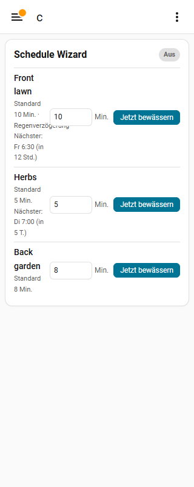

# UX-019 Card in German at 320 px: long zone text runs under the minutes field

| | |
|---|---|
| Type | UX ISSUE |
| Severity | low |
| Status | Fix handed back, awaiting verification: [#99](https://github.com/bareli/schedule_wizard/issues/99) |
| Issue | [#99](https://github.com/bareli/schedule_wizard/issues/99) |
| Feature | Lovelace card |
| Test case | CARD de 320 |
| Environment | tests only (no instance), `feature/v0.15.0` @ `6779b5a` |
| Branch / commit | fix/v0.15.0-last @ 7399cca |
| Detected by | v0.15.0 final pass |
| Detected | 2026-10-01 |
| Model | sonnet |

## Summary

Zone text column shrinks to ~51 px; "Regenverzögerung" overlaps the minutes field. Evidence: 

## Expected

Long words wrap inside their column; no overlap; RTL kept.

## Actual

Overlap at 320 px in de.

## Relevant files

custom_components/schedule_wizard/www/card.js, tests/test_v015_last.py

## Handback

Full handback with recipe on issue #99.
